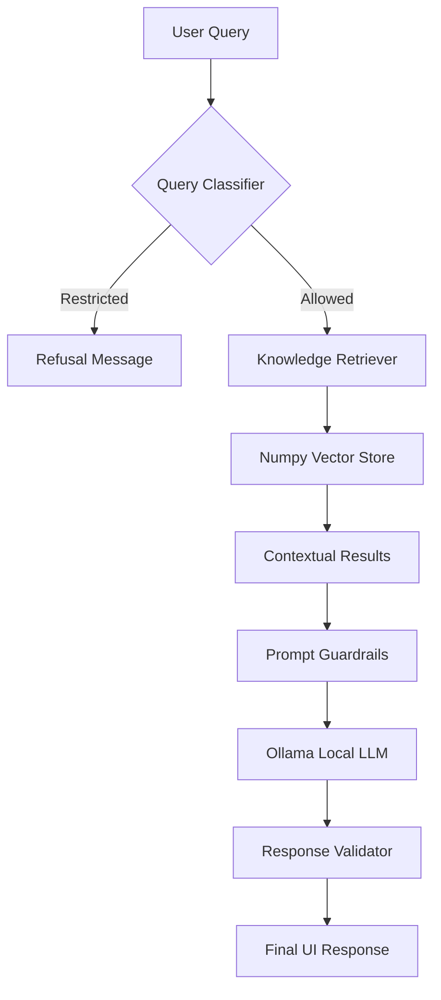

# 🎓 EdTech Learning Assistant


## 🌟 Overview
The **EdTech Learning Assistant** is a premium, locally-hosted AI solution designed to help students navigate complex course structures, understand assessment policies, and track their learning progress. Built with a **privacy-first** approach, it leverages **Ollama** for local inference and a custom-built **Numpy-powered RAG system** for lightning-fast knowledge retrieval.

---

## 🔥 Key Features

- **🧠 Local LLM Integration**: Powered by `Ollama` (default: `qwen2.5:3b`) for 100% private, offline conversations.
- **📚 Smart RAG System**: Custom vector store implementation using `Numpy` for semantic search across course documentation.
- **🛡️ Multi-Agent Guardrails**: 
  - **Query Classifier**: Routes questions and blocks restricted content.
  - **Prompt Guardrails**: Ensures the AI sticks to the provided knowledge context.
  - **Response Validator**: Checks AI output for safety and academic integrity.
- **💎 Premium UI**: Glassmorphic Streamlit dashboard with modern dark-mode aesthetics and smooth animations.
- **📊 Progress Visualizer**: Context-aware explanations of how learning milestones and certifications work.

---

## 🏗 Architecture

The bot follows a sophisticated RAG (Retrieval-Augmented Generation) pipeline designed for Python 3.14+ compatibility:



---

## 🛠 Tech Stack

- **Frontend**: [Streamlit](https://streamlit.io/) (Custom CSS with Glassmorphism)
- **AI Inference**: [Ollama](https://ollama.ai/)
- **Embeddings**: Local Ollama Embeddings
- **Vector Search**: [Numpy](https://numpy.org/) (Cosine Similarity)
- **Language**: Python 3.14+
- **RAG Engine**: [LangChain](https://www.langchain.com/) (Text Splitters)

---

## 🚀 Getting Started

### 1. Prerequisites
- **Python 3.14+**
- **Ollama** installed and running on your system.

### 2. Pull the Models
```bash
# Pull the chat and embedding model
ollama pull qwen2.5:3b
```

### 3. Installation
```bash
# Clone the repository
git clone https://github.com/Zahid-coder-17/bot.git
cd bot

# Install dependencies
pip install -r requirements.txt
```

### 4. Configuration
Create a `.env` file in the root directory:
```env
OLLAMA_BASE_URL=http://localhost:11434
OLLAMA_CHAT_MODEL=qwen2.5:3b
EMBEDDING_MODEL=qwen2.5:3b
```

### 5. Ingest Knowledge
Populate the vector store with your course documents:
```bash
python scripts/ingest_knowledge.py
```

### 6. Run the App
```bash
streamlit run app.py
```

---

## 📄 License
This project is licensed under the MIT License - see the LICENSE file for details.

---
<p align="center">Made with ❤️ for the future of Education</p>
